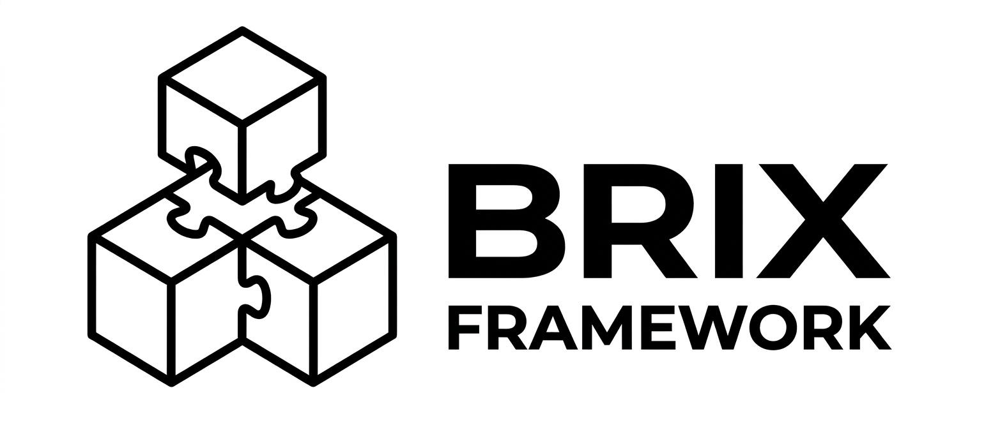

<p align="center">
  
</p>

<h1 align="center">Brix Framework</h1>

<p align="center">
  <strong>A Runtime Shell framework for building modular, pluggable enterprise applications with zero infrastructure dependencies</strong>
</p>

<p align="center">
  <a href="./LICENSE"></a>
  
  
  
</p>

<p align="center">
  <a href="https://github.com/brix-kit-dev/brix">Documentation</a> •
  <a href="https://github.com/brix-kit-dev/brix/getting-started">Getting Started</a> •
  <a href="#-quick-start">Quick Start</a> •
  <a href="https://github.com/brix-kit-dev/brix/discussions">Community</a>
</p>

---

## ✨ Why Brix?

Brix implements the **Runtime Shell Architecture** (v1.0.0), enabling you to build enterprise applications with:

| Feature | Description |
|---------|-------------|
| 🔌 **Plugin Architecture** | Build self-contained business modules that work anywhere |
| 🎯 **Capability Contract** | Zero infrastructure dependencies in your plugins |
| 📦 **Module Federation** | First-class micro-frontend support with shared runtime |
| 🚀 **Ultra-Thin Host** | Pure configuration-driven assembly, zero business logic |
| 🔄 **Event-Driven** | Loose coupling through governed event bus |
| 📱 **Multi-Platform** | Web, Mobile (React Native), and Backend (Java/Spring) |

## 🏗️ Architecture

```text
┌─────────────────────────────────────────────────────────────────────┐
│  Layer 3: Host (Ultra-Thin Assembly Shell)                          │
│  └── Pure configuration: pom.xml + YAML + Boot class (< 30 lines)  │
├─────────────────────────────────────────────────────────────────────┤
│  Layer 2: Capability Layer                                          │
│  ├── 2A: Contracts (runtime-sdk-api) — Pure interfaces             │
│  ├── 2B: Shared Runtime (@brix/shared-runtime-web)                  │
│  └── 2C: Implementations (infra-adapters, platform-commons)         │
├─────────────────────────────────────────────────────────────────────┤
│  Layer 1: Plugins (Business Modules)                                │
│  └── Only depends on Layer 2A Capability Contracts                  │
├─────────────────────────────────────────────────────────────────────┤
│  Layer 0: Infrastructure (Hidden from plugins)                      │
│  └── Kafka, Redis, PostgreSQL, MinIO, etc.                          │
└─────────────────────────────────────────────────────────────────────┘
```

**Key Constraints:**
- Plugins depend ONLY on capability contracts (Layer 2A)
- No Kafka/Redis/HTTP client code in plugins
- Cross-plugin communication via events only
- Host contains zero implementation code

## 📦 Packages

| Package | Description | Layer |
|---------|-------------|-------|
| `@brix/runtime-sdk` | Runtime capability contracts and orchestration | 2A/2B |
| `@brix/infra-adapters` | Infrastructure adapter implementations (Kafka, Redis, etc.) | 2C |
| `@brix/platform-commons` | Platform capabilities (Auth, Gateway, Observability) | 2C |
| `@brix/platform-devtools` | Architecture guard, scaffolding, and build tools | Tools |

## 🚀 Quick Start

### Prerequisites

- **Node.js** >= 18.0.0 and **pnpm** >= 8.0.0
- **Java** 17+ and **Maven** 3.8+

### Create Your First Plugin

```bash
# Install the CLI
pnpm add -g @brix/create-brix

# Create a new plugin
pnpm create @brix/brix plugin my-plugin

# Navigate and start development
cd my-plugin
pnpm dev
```

### Plugin Code Example

```typescript
// my-plugin/src/MyPluginModule.ts
import { PluginModule, RuntimeContext } from '@brix/runtime-sdk-api-web';
import { EventBusCapability, HttpCapability } from '@brix/runtime-sdk-api-web';

export class MyPluginModule implements PluginModule {
  async initialize(context: RuntimeContext): Promise<void> {
    // Get capabilities from runtime - no infrastructure dependencies!
    const eventBus = context.getCapability(EventBusCapability);
    const http = context.getCapability(HttpCapability);
    
    // Subscribe to events from other plugins
    eventBus.subscribe('user.created', this.handleUserCreated);
    
    // Publish events for other plugins
    eventBus.publish('my-plugin.ready', { timestamp: Date.now() });
  }
  
  private handleUserCreated = async (event: DomainEvent) => {
    // Business logic here - completely infrastructure-agnostic
  };
}
```

### Build from Source

```bash
# Clone the repository
git clone https://github.com/brix-kit-dev/brix.git
cd brix

# Install frontend dependencies
pnpm install
pnpm build

# Build Java modules
mvn clean install
```

## 📚 Documentation

| Document | Description |
|----------|-------------|
| [Architecture Blueprint](docs/architecture-blueprint.md) | Complete v1.0.0 Runtime Shell design |
| [Plugin Development Guide](docs/plugin-development.md) | Step-by-step plugin creation tutorial |
| [Capability Reference](docs/capability-contracts.md) | All available capability interfaces |
| [Architecture Guard](packages/@brix/platform-devtools/architecture-guard/README.md) | 13 red-line rules and ArchUnit tests |

## 🤝 Contributing

We welcome contributions! Please see our [Contributing Guide](CONTRIBUTING.md) for details.

- 🐛 [Report a Bug](https://github.com/brix-kit-dev/brix/issues/new?template=bug_report.md)
- 💡 [Request a Feature](https://github.com/brix-kit-dev/brix/issues/new?template=feature_request.md)
- 💬 [Discussions](https://github.com/brix-kit-dev/brix/discussions)

## 👥 Community

Join our community to get help, share ideas, and contribute:

- �️ **[Discussions](https://github.com/brix-kit-dev/brix/discussions)** - Ask questions and share ideas
- 📧 **[brix.kit.dev@gmail.com](mailto:brix.kit.dev@gmail.com)** - Contact & report security vulnerabilities

## 📖 Further Reading

- [Security Policy](SECURITY.md) - How to report vulnerabilities
- [Code of Conduct](CODE_OF_CONDUCT.md) - Community guidelines
- [Changelog](packages/@brix/runtime-sdk/CHANGELOG.md) - Version history

## 📄 License

[Apache License 2.0](LICENSE) - see the LICENSE file for details.

---

<p align="center">Made with ❤️ by the Brix Community</p>
