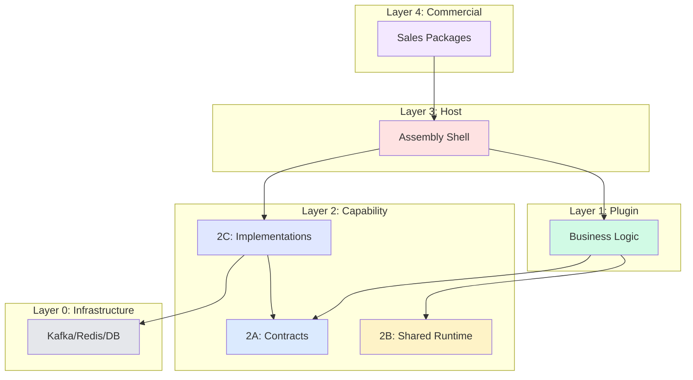

# Architecture Layers

Brix Framework implements a strict 5-layer architecture (Layer 0 through Layer 4) with clear dependency rules.

## Layer Overview

```
┌─────────────────────────────────────────────────────────────────────────────────────────┐
│                         Brix Platform Architecture Layers                               │
├─────────────────────────────────────────────────────────────────────────────────────────┤
│                                                                                          │
│  Layer 4: Commercial Layer (Selling Model)                                              │
│  ═══════════════════════════════════════════════════════════════════════════════════════│
│  │ Full Platform │ Solution Pack │ Plugin Bundle │ Single Plugin │                     │
│                                                                                          │
│  Layer 3: Host Layer (Ultra-Thin Assembly Shell)                                        │
│  ═══════════════════════════════════════════════════════════════════════════════════════│
│  │ Standalone Host │ Embedded Host │ - Zero implementation code                        │
│                                                                                          │
│  Layer 2: Capability Layer                                                              │
│  ═══════════════════════════════════════════════════════════════════════════════════════│
│  ├── 2A: Contracts         - Pure interfaces (runtime-sdk-api)                          │
│  ├── 2B: Shared Runtime    - React, Router, State (@brix/shared-runtime-web)           │
│  └── 2C: Implementations   - Adapters (infra-adapters, platform-commons)               │
│                                                                                          │
│  Layer 1: Plugin Layer (Business Modules)                                               │
│  ═══════════════════════════════════════════════════════════════════════════════════════│
│  │ Order Plugin │ Reservation Plugin │ User Plugin │ ... │                             │
│                                                                                          │
│  Layer 0: Infrastructure Layer (Hidden)                                                 │
│  ═══════════════════════════════════════════════════════════════════════════════════════│
│  │ Kafka │ Redis │ PostgreSQL │ MinIO │ OpenTelemetry │                                │
│                                                                                          │
└─────────────────────────────────────────────────────────────────────────────────────────┘
```

## Layer 0: Infrastructure

**What it is:** Raw infrastructure components
**Who accesses it:** Only Layer 2C adapters
**Examples:** Kafka, Redis, PostgreSQL, MinIO, S3, OpenTelemetry

:::danger Forbidden Access
Layers 1 and 3 must NEVER access Layer 0 directly.
:::

```java
// ✅ Layer 2C adapter - CAN access infrastructure
public class KafkaEventBusAdapter implements EventBusCapability {
    private final KafkaProducer<String, String> producer; // Kafka client OK here
}

// ❌ Layer 1 plugin - CANNOT access infrastructure
@Service
public class OrderService {
    private final KafkaProducer producer; // VIOLATION!
}
```

## Layer 1: Plugin

**What it is:** Business logic modules
**Dependencies:** Only Layer 2A contracts
**Packages:** `com.example.{plugin}.core`, `com.example.{plugin}.server`

### Plugin Dependency Rules

| FROM Plugin | TO | Allowed? |
|-------------|-----|----------|
| Plugin | Layer 2A Contracts | ✅ Yes |
| Plugin | Layer 2B Shared Runtime | ✅ Yes (frontend) |
| Plugin | Other Plugin | ❌ No |
| Plugin | Layer 2C Adapters | ❌ No |
| Plugin | Layer 0 Infrastructure | ❌ No |

### Plugin Code Structure

```
plugin-order/
├── core/                           # Domain layer
│   ├── service/OrderService.java   # Uses capabilities only
│   ├── model/Order.java            # Domain entity
│   └── event/OrderEventHandler.java
├── server/                         # REST layer
│   └── controller/OrderController.java
└── shared/                         # Contract with frontend
    └── types/
```

## Layer 2: Capability

Layer 2 has three sub-layers:

### Layer 2A: Contracts

**What it is:** Pure interface definitions
**Examples:** `EventBusCapability`, `StateStoreCapability`, `HttpCapability`
**Packages:** `io.brix.runtime.sdk.api`

```java
// Layer 2A - Pure interface, no implementation
public interface EventBusCapability {
    void publish(String eventType, Object payload);
    void subscribe(String eventType, EventHandler handler);
}
```

### Layer 2B: Shared Runtime (Frontend)

**What it is:** Shared runtime dependencies for frontend
**Examples:** React, React Router, State management
**Packages:** `@brix/shared-runtime-web`, `@brix/shared-runtime-mobile`

:::info Constraint #8
> All frontend runtime dependencies (React, Router, State) must come from `@brix/shared-runtime-web`.
> 
> This prevents React multi-instance issues in Module Federation.
:::

```typescript
// ✅ Correct - Import from shared-runtime
import { React, useState } from '@brix/shared-runtime-web';

// ❌ Wrong - Direct import causes multi-instance
import React from 'react'; // VIOLATION!
```

### Layer 2C: Implementations

**What it is:** Concrete implementations of Layer 2A contracts
**Examples:** `KafkaEventBusAdapter`, `RedisStateStoreAdapter`
**Packages:** `io.brix.infra.adapter.*`, `io.brix.platform.*`

```java
// Layer 2C - Implements contract, uses Layer 0
public class KafkaEventBusAdapter implements EventBusCapability {
    private final KafkaProducer<String, String> producer;
    
    @Override
    public void publish(String eventType, Object payload) {
        producer.send(new ProducerRecord<>(eventType, serialize(payload)));
    }
}
```

## Layer 3: Host

**What it is:** Ultra-thin assembly shell
**Content:** ONLY pom.xml + YAML + Boot class (<30 lines)
**Examples:** `host-shell-standalone`, `host-shell-embedded`

### Host Dependency Rules

| FROM Host | TO | Allowed? |
|-----------|-----|----------|
| Host | Layer 2C Adapters | ✅ Yes (via pom.xml) |
| Host | Layer 1 Plugins | ✅ Yes (via pom.xml) |
| Host | Layer 0 Infrastructure | ❌ No (indirect via adapters) |

## Layer 4: Commercial

**What it is:** Selling and packaging model
**Types:**
- **Full Platform**: All plugins + Standalone Host
- **Solution Pack**: Curated plugin set for specific domain
- **Plugin Bundle**: Multiple plugins sold together
- **Single Plugin**: Individual plugin for Embedded mode

## Dependency Flow Diagram



## Code Repository Mapping

| Repository | Layers | Contents |
|------------|--------|----------|
| `brix` (Open Source) | 2A, 2B, 2C | runtime-sdk, infra-adapters, platform-commons, platform-devtools |
| `brix-enterprise` | 1, 3 | enterprise-solutions (plugins), enterprise-host |

## Architecture Guard Enforcement

These layer rules are enforced automatically:

```java
@ArchTest
static final ArchRule pluginsCannotAccessInfrastructure = noClasses()
    .that().resideInAPackage("..plugin..")
    .should().dependOnClassesThat()
    .resideInAnyPackage(
        "org.apache.kafka..",
        "redis.clients..",
        "org.postgresql..",
        "io.minio.."
    );

@ArchTest
static final ArchRule pluginsCanOnlyDependOnContracts = classes()
    .that().resideInAPackage("..plugin..core..")
    .should().onlyDependOnClassesThat()
    .resideInAnyPackage(
        "io.brix.runtime.sdk.api..",
        "java..",
        "..plugin..core.."
    );
```

## Next Steps

- [Architecture Guard](../guides/architecture-guard) - Red-line rule details
- [Plugin Development](../guides/plugin-development) - Build plugins correctly
- [Host Assembly](./host-assembly) - Assembling hosts
