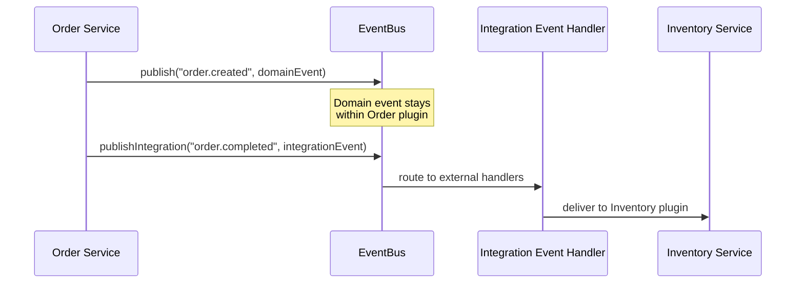

# Event Model

Brix uses an event-driven architecture for loose coupling between plugins. There are two types of events: **Domain Events** and **Integration Events**.

## Event Types

### Domain Events

Domain Events are internal to a plugin's bounded context. They represent something that happened within your plugin.

```java
/**
 * Domain Event: Published within the Order plugin.
 * Other services within the same plugin can subscribe.
 */
public record OrderCreatedEvent(
    String orderId,
    String customerId,
    List<LineItem> items,
    BigDecimal totalAmount,
    Instant createdAt
) {}
```

**Characteristics:**
- Scoped to single plugin
- Rich domain objects in payload
- High frequency
- Not guaranteed delivery (best-effort)

### Integration Events

Integration Events cross plugin boundaries. They define the contract with other plugins.

```java
/**
 * Integration Event: Published for other plugins to consume.
 * Uses primitive types and IDs, not domain objects.
 */
public record OrderCompletedIntegrationEvent(
    String orderId,
    String customerId,
    String orderTotal,       // String, not BigDecimal
    String completedAt       // ISO string, not Instant
) {}
```

**Characteristics:**
- Cross-plugin communication
- Primitive types only (IDs, strings)
- Lower frequency
- Guaranteed delivery (at-least-once)

## Event Flow



## Publishing Events

### Domain Events

```java
@Service
public class OrderService {
    
    private final EventBusCapability eventBus;
    
    public Order createOrder(CreateOrderRequest request) {
        Order order = Order.create(request);
        orderRepository.save(order);
        
        // Publish domain event - internal to this plugin
        eventBus.publish("order.created", new OrderCreatedEvent(
            order.getId(),
            order.getCustomerId(),
            order.getItems(),
            order.getTotalAmount(),
            order.getCreatedAt()
        ));
        
        return order;
    }
}
```

### Integration Events

```java
public void completeOrder(String orderId) {
    Order order = orderRepository.findById(orderId)
        .orElseThrow(() -> new OrderNotFoundException(orderId));
    
    order.complete();
    orderRepository.save(order);
    
    // Publish integration event - for other plugins
    eventBus.publishIntegration("order.completed", new OrderCompletedIntegrationEvent(
        order.getId(),
        order.getCustomerId(),
        order.getTotalAmount().toString(),
        Instant.now().toString()
    ));
}
```

## Subscribing to Events

### Using @EventHandler Annotation

```java
@Component
public class InventoryEventHandler {
    
    private final InventoryService inventoryService;
    
    /**
     * Handles order completion to update inventory.
     * 
     * This handler receives Integration Events from Order plugin.
     */
    @EventHandler("order.completed")
    public void onOrderCompleted(OrderCompletedIntegrationEvent event) {
        // Reserve inventory for the completed order
        inventoryService.reserveForOrder(event.orderId());
    }
}
```

### Programmatic Subscription

```java
@PostConstruct
public void registerHandlers() {
    eventBus.subscribe("user.registered", event -> {
        sendWelcomeEmail(event);
    });
}
```

## Event Contracts

Define your events in the shared module:

```typescript title="shared/events/OrderEvents.ts"
/**
 * Event contracts for Order plugin.
 * 
 * Integration events use primitive types for interoperability.
 */
export namespace OrderEvents {
  
  export const ORDER_CREATED = 'order.created';
  export const ORDER_COMPLETED = 'order.completed';
  export const ORDER_CANCELLED = 'order.cancelled';
  
  export interface OrderCompletedPayload {
    orderId: string;
    customerId: string;
    totalAmount: string;
    completedAt: string;
  }
}
```

## Event Guarantees

| Event Type | Delivery | Ordering | Use Case |
|------------|----------|----------|----------|
| Domain | At-most-once | Not guaranteed | UI updates, analytics |
| Integration | At-least-once | Per partition | Cross-plugin workflows |

### Handling Duplicates

Integration Events may be delivered multiple times. Make handlers idempotent:

```java
@EventHandler("payment.completed")
public void onPaymentCompleted(PaymentCompletedEvent event) {
    // Idempotent: Check if already processed
    if (orderRepository.isPaymentProcessed(event.paymentId())) {
        log.info("Payment {} already processed, skipping", event.paymentId());
        return;
    }
    
    // Process payment
    orderService.markAsPaid(event.orderId(), event.paymentId());
}
```

## Event Routing

The Runtime Shell routes events based on configuration:

```yaml
brix:
  events:
    routing:
      # Domain events stay local
      domain:
        transport: in-memory
      # Integration events go through Kafka
      integration:
        transport: kafka
        topics:
          order.completed: orders-integration
          payment.completed: payments-integration
```

## Frontend Events

Frontend can also publish and subscribe to events:

```typescript
function useOrderEvents() {
  const eventBus = useCapability(EventBusCapability);
  
  const publishOrderViewed = (orderId: string) => {
    eventBus.publish('order.viewed', { orderId, timestamp: Date.now() });
  };
  
  useEffect(() => {
    const unsubscribe = eventBus.subscribe('cart.updated', (event) => {
      // Update local state when cart changes
      refreshCart();
    });
    
    return () => unsubscribe();
  }, [eventBus]);
  
  return { publishOrderViewed };
}
```

## Event Sourcing Support

For plugins that need event sourcing:

```java
public interface EventSourcedRepository<T> {
    
    /**
     * Loads aggregate from event stream.
     */
    T load(String aggregateId);
    
    /**
     * Saves new events to the stream.
     */
    void save(T aggregate, List<DomainEvent> events);
    
    /**
     * Gets all events for an aggregate.
     */
    List<StoredEvent> getEvents(String aggregateId);
}
```

## Best Practices

1. **Name events in past tense**: `order.created`, not `order.create`
2. **Include timestamp**: Always include when the event occurred
3. **Use IDs, not objects**: In integration events, use IDs, not full objects
4. **Version your events**: For breaking changes, version the event type
5. **Document event contracts**: Use TypeScript types or JSON Schema

## Next Steps

- [Host Assembly](./host-assembly) - How events are routed
- [Plugin Development](../guides/plugin-development) - Build event-driven plugins
- [Testing Guide](../guides/testing) - Test event handlers
