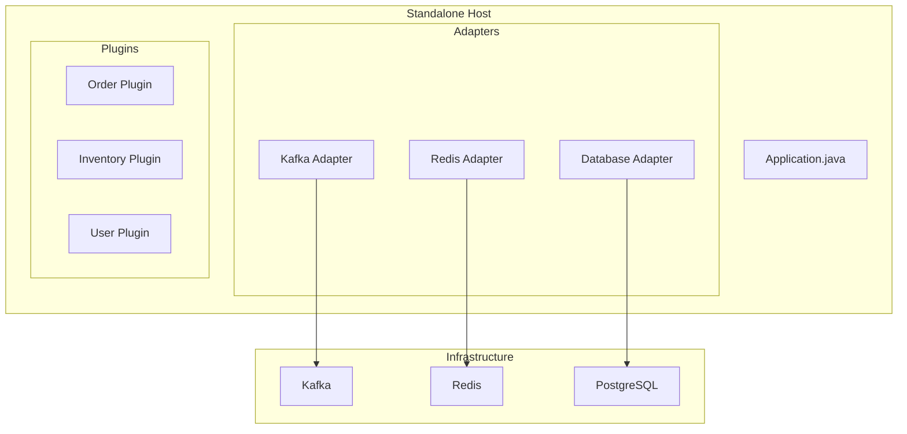

# Host Assembly

The **Host** is the ultra-thin assembly shell that wires plugins with capability implementations. It contains zero business logic.

## Design Constraint #6: Ultra-Thin Host

:::warning Ultra-Thin Host Principle
> Host contains ONLY: `pom.xml` + `YAML config` + `Boot class (< 30 lines)`
> 
> **Forbidden in Host:**
> - Service classes
> - Helper/Utility classes
> - Custom Bean definitions
> - if/else logic, loops, data transformation
:::

## Host Structure

A compliant Host looks like this:

```
my-host/
├── pom.xml                           # Dependency declarations
├── src/
│   └── main/
│       ├── java/
│       │   └── com/example/host/
│       │       └── Application.java  # < 30 lines
│       └── resources/
│           └── application.yml       # Configuration only
└── README.md
```

### pom.xml

The Host selects capabilities through Maven dependencies:

```xml
<?xml version="1.0" encoding="UTF-8"?>
<project>
    <modelVersion>4.0.0</modelVersion>
    
    <parent>
        <groupId>io.brix</groupId>
        <artifactId>platform-parent</artifactId>
        <version>3.1.0</version>
    </parent>
    
    <artifactId>my-standalone-host</artifactId>
    <name>My Application - Standalone Host</name>
    
    <dependencies>
        <!-- Capability Implementations -->
        <dependency>
            <groupId>io.brix</groupId>
            <artifactId>infra-adapter-kafka</artifactId>
        </dependency>
        <dependency>
            <groupId>io.brix</groupId>
            <artifactId>infra-adapter-redis</artifactId>
        </dependency>
        <dependency>
            <groupId>io.brix</groupId>
            <artifactId>infra-adapter-database</artifactId>
        </dependency>
        
        <!-- Platform Capabilities -->
        <dependency>
            <groupId>io.brix.platform</groupId>
            <artifactId>platform-auth</artifactId>
        </dependency>
        <dependency>
            <groupId>io.brix.platform</groupId>
            <artifactId>platform-gateway</artifactId>
        </dependency>
        
        <!-- Plugins -->
        <dependency>
            <groupId>com.example</groupId>
            <artifactId>order-plugin</artifactId>
        </dependency>
        <dependency>
            <groupId>com.example</groupId>
            <artifactId>inventory-plugin</artifactId>
        </dependency>
    </dependencies>
</project>
```

### Application.java

The Boot class is minimal:

```java
package com.example.host;

import org.springframework.boot.SpringApplication;
import org.springframework.boot.autoconfigure.SpringBootApplication;

/**
 * Standalone Host Application.
 * 
 * This is an ultra-thin assembly shell. All functionality comes from:
 * - Capability adapters (infra-adapter-*)
 * - Platform modules (platform-*)
 * - Business plugins (*-plugin)
 * 
 * @see <a href="https://docs.brix.dev/concepts/host-assembly">Host Assembly</a>
 */
@SpringBootApplication
public class Application {
    
    public static void main(String[] args) {
        SpringApplication.run(Application.class, args);
    }
}
```

**Total: 15 lines**. Any more logic violates the Ultra-Thin Host constraint.

### application.yml

All configuration is declarative:

```yaml
spring:
  application:
    name: my-application
  profiles:
    active: standalone

# Capability configuration
brix:
  capabilities:
    event-bus:
      type: kafka
      kafka:
        bootstrap-servers: ${KAFKA_SERVERS:localhost:9092}
    state-store:
      type: redis
      redis:
        host: ${REDIS_HOST:localhost}
        port: ${REDIS_PORT:6379}
    data-access:
      type: postgresql
      datasource:
        url: jdbc:postgresql://${DB_HOST:localhost}:5432/myapp
        username: ${DB_USER:postgres}
        password: ${DB_PASSWORD:postgres}

# Plugin configuration
plugins:
  order:
    enabled: true
  inventory:
    enabled: true
```

## Deployment Modes

### Standalone Host

Full platform with all infrastructure:



### Embedded Host

Lightweight mode for embedding in customer systems:

```xml
<!-- Embedded Host pom.xml -->
<dependencies>
    <!-- Simple adapters instead of full infrastructure -->
    <dependency>
        <groupId>io.brix</groupId>
        <artifactId>infra-adapter-simple</artifactId>
    </dependency>
    <dependency>
        <groupId>io.brix</groupId>
        <artifactId>infra-adapter-webhook</artifactId>
    </dependency>
    
    <!-- Only the required plugins -->
    <dependency>
        <groupId>com.example</groupId>
        <artifactId>order-plugin</artifactId>
    </dependency>
</dependencies>
```

```yaml
# Embedded Host configuration
brix:
  capabilities:
    event-bus:
      type: simple      # In-memory, no Kafka
    state-store:
      type: simple      # In-memory, no Redis
    integration:
      type: webhook     # Webhooks to customer systems
      webhook:
        target-url: ${CUSTOMER_WEBHOOK_URL}
```

## Capability Equivalence

:::info Design Constraint #3
> Standalone and Embedded Hosts provide **identical** Capability interfaces.
> 
> The difference is only in implementation complexity, not functionality.
:::

Your plugin code works in both modes without changes:

```java
// This works in BOTH Standalone and Embedded
@Service
public class OrderService {
    private final EventBusCapability eventBus; // Same interface!
    
    public void completeOrder(String orderId) {
        // In Standalone: goes to Kafka
        // In Embedded: stays in-memory
        eventBus.publish("order.completed", event);
    }
}
```

## Host Anti-Patterns

❌ **Service class in Host**

```java
// VIOLATION: Business logic in Host
@Service
public class OrderProcessingService {
    public void processOrder(Order order) { ... }
}
```

❌ **Helper class in Host**

```java
// VIOLATION: Utility code in Host
public class StringUtils {
    public static String format(...) { ... }
}
```

❌ **Custom Bean definition**

```java
// VIOLATION: Bean definitions belong in plugins
@Configuration
public class CustomConfig {
    @Bean
    public MyCustomBean customBean() { ... }
}
```

❌ **Conditional logic**

```java
// VIOLATION: Logic belongs in plugins/adapters
@Component
public class ConditionalRouter {
    public void route(Message msg) {
        if (msg.getType().equals("A")) { ... }
    }
}
```

## Host Testing

Hosts have minimal tests (they're just assembly):

```java
@SpringBootTest
class HostIntegrationTest {
    
    @Test
    void contextLoads() {
        // Host should start without errors
    }
    
    @Test
    void allCapabilitiesRegistered() {
        // Verify all expected capabilities are available
        assertThat(context.getBean(EventBusCapability.class)).isNotNull();
        assertThat(context.getBean(StateStoreCapability.class)).isNotNull();
    }
}
```

## Switching Capabilities

Change adapters through profiles:

```yaml
# application-standalone.yml
brix.capabilities.event-bus.type: kafka

# application-embedded.yml  
brix.capabilities.event-bus.type: simple

# application-test.yml
brix.capabilities.event-bus.type: mock
```

```bash
# Run with different profiles
java -jar app.jar --spring.profiles.active=standalone
java -jar app.jar --spring.profiles.active=embedded
```

## Next Steps

- [Architecture Layers](./architecture-layers) - Complete layer breakdown
- [Deployment Guide](../guides/deployment) - Deploy hosts to production
- [Architecture Guard](../guides/architecture-guard) - Validate host compliance
