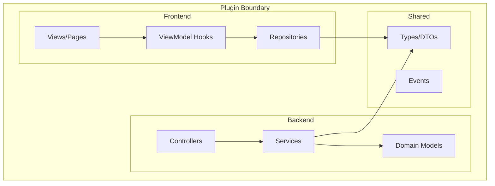
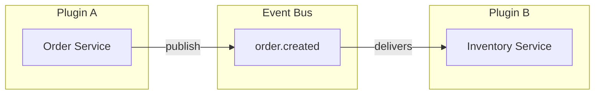

# Plugin Model

A **Plugin** is the smallest deployable and sellable business unit in Brix. It contains domain logic, UI components, and API endpoints, all depending only on Capability Contracts.

## Plugin Definition

:::info Key Concept
A plugin is self-contained. It can run in any host (Standalone or Embedded) without code changes.
:::



## Plugin Structure

```
my-plugin/
├── frontend/
│   ├── web/                    # Web UI (React)
│   │   ├── pages/              # Page components (View)
│   │   ├── components/         # Reusable UI components
│   │   ├── hooks/              # ViewModel hooks  
│   │   ├── repositories/       # API calls via HttpCapability
│   │   └── index.ts            # Plugin entry point
│   │
│   ├── mobile/                 # Mobile UI (React Native)
│   │   └── ...
│   │
│   └── shared/                 # Shared types
│       ├── types/              # TypeScript interfaces
│       └── events/             # Event type definitions
│
├── backend/
│   ├── core/                   # Domain logic (Layer 1)
│   │   ├── service/            # Domain services
│   │   ├── model/              # Domain entities
│   │   └── event/              # Event handlers
│   │
│   ├── server/                 # REST layer
│   │   └── controller/         # REST controllers
│   │
│   └── test/                   # Tests including Architecture Guard
│
├── package.json                # Frontend dependencies
└── pom.xml                     # Backend dependencies
```

## Plugin Lifecycle

Plugins implement a standard lifecycle:

```typescript
// Frontend Plugin Module
export class MyPluginModule implements PluginModule {
  
  /**
   * Called when the plugin is loaded.
   * Register routes, capabilities, and event handlers.
   */
  async initialize(context: RuntimeContext): Promise<void> {
    // Register routes
    context.router.register('/my-plugin', MyPluginRoutes);
    
    // Subscribe to events
    const eventBus = context.getCapability(EventBusCapability);
    eventBus.subscribe('user.created', this.handleUserCreated);
  }
  
  /**
   * Called when the plugin is being unloaded.
   * Clean up resources, unsubscribe handlers.
   */
  async destroy(): Promise<void> {
    // Cleanup
  }
}
```

```java
// Backend Plugin Configuration
@Configuration
public class MyPluginConfiguration {
    
    @Bean
    @PluginInitializer
    public PluginLifecycle myPluginLifecycle(RuntimeContext context) {
        return new PluginLifecycle() {
            @Override
            public void onStart() {
                // Plugin startup logic
            }
            
            @Override
            public void onStop() {
                // Plugin shutdown logic
            }
        };
    }
}
```

## Plugin Manifest

Each plugin declares its metadata and requirements:

```json title="META-INF/plugin-manifest.json"
{
  "plugin": {
    "id": "reservation-plugin",
    "name": "Reservation Management",
    "version": "1.0.0",
    "vendor": "Brix Framework"
  },
  "capabilities": {
    "required": [
      "EventBusCapability",
      "StateStoreCapability",
      "AuthContextCapability"
    ],
    "optional": [
      "NotificationCapability"
    ]
  },
  "events": {
    "publishes": [
      "reservation.created",
      "reservation.cancelled"
    ],
    "subscribes": [
      "user.created",
      "payment.completed"
    ]
  },
  "permissions": [
    "reservation.create",
    "reservation.view",
    "reservation.cancel"
  ]
}
```

## Plugin Dependencies

:::warning Design Constraint #4
> Plugins communicate through events, never directly.
:::

Plugins must NOT:
- Import classes from other plugins
- Call other plugin's REST APIs directly
- Share database tables with other plugins

Plugins SHOULD:
- Publish events for integration points
- Subscribe to events from other plugins
- Define clear event contracts



## Frontend Plugin Architecture

The frontend follows the **View → ViewModel → Repository** pattern:

### View Layer (Pages/Components)
- Pure rendering, no business logic
- Uses hooks for data and actions
- No direct HTTP/fetch calls

```tsx
// ✅ Correct - Uses hook
function ReservationList() {
  const { reservations, loading } = useReservations();
  return <List data={reservations} loading={loading} />;
}

// ❌ Wrong - Direct fetch
function ReservationList() {
  const [data, setData] = useState([]);
  useEffect(() => {
    fetch('/api/reservations').then(...); // VIOLATION!
  }, []);
}
```

### ViewModel Layer (Hooks)
- Business logic and state management
- Orchestrates repository calls
- Handles UI state (loading, errors)

```typescript
function useReservations() {
  const http = useCapability(HttpCapability);
  const repo = new ReservationRepository(http);
  
  // State and business logic here
  return { reservations, loading, create, cancel };
}
```

### Repository Layer
- API calls via HttpCapability
- Data transformation
- Caching logic

```typescript
class ReservationRepository {
  constructor(private http: HttpCapability) {}
  
  async getAll(): Promise<Reservation[]> {
    return this.http.get('/api/reservations');
  }
}
```

## Backend Plugin Architecture

### Core Layer (Domain)
- Domain services and entities
- Business rules
- Uses only Capability interfaces

### Server Layer (REST)
- REST controllers
- Request/response mapping
- Depends on Core layer

```
core/                     server/
├── service/              └── controller/
│   └── OrderService.java     └── OrderController.java
├── model/                    
│   └── Order.java            
└── event/                    
    └── OrderEventHandler.java
```

## Plugin Isolation

Each plugin runs in isolation:

| Aspect | Isolation Level |
|--------|-----------------|
| Database | Per-plugin schema or table prefix |
| State Store | Namespaced keys |
| Events | Plugin prefix on event types |
| Config | Plugin-scoped configuration |
| Auth | Plugin permissions checked |

## Next Steps

- [Event Model](./event-model) - Inter-plugin communication
- [Plugin Development Guide](../guides/plugin-development) - Build a complete plugin
- [Testing Guide](../guides/testing) - Test your plugins
