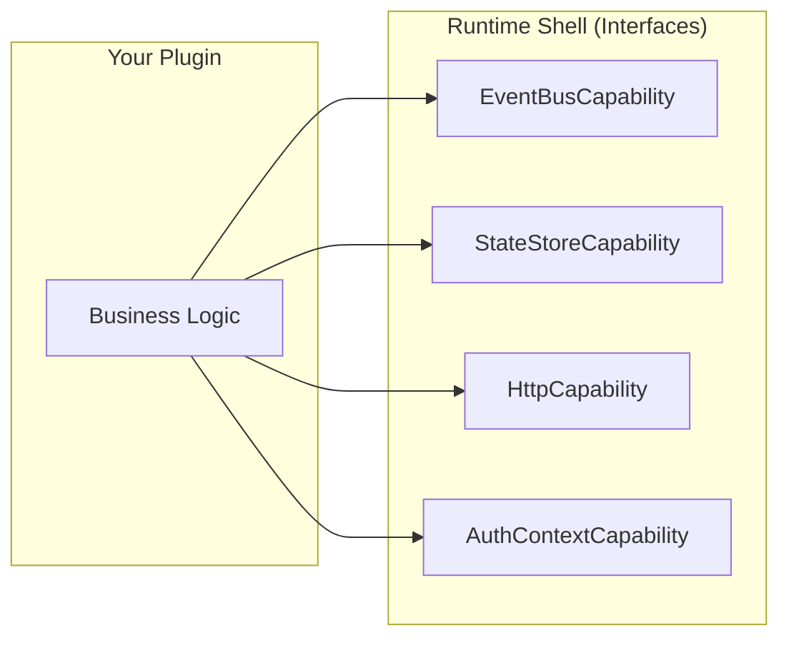
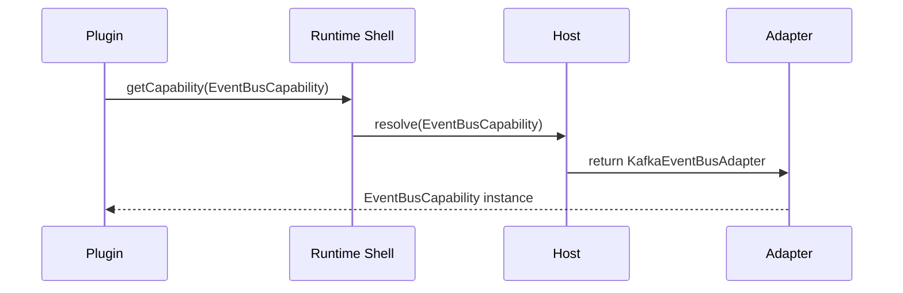

# Runtime Shell

The **Runtime Shell** is the core abstraction of Brix Framework. It represents the set of **Capability Contracts** that plugins depend on, completely decoupling business logic from infrastructure.

## What is Runtime Shell?

Runtime Shell is NOT:
- ❌ A framework you install
- ❌ A middleware process
- ❌ A library with implementation code

Runtime Shell IS:
- ✅ A set of interface contracts (Capability Contracts)
- ✅ Assembled by different Hosts with different implementations
- ✅ The "runtime environment" your plugins depend on



## Design Constraint #1

> **Runtime Shell is a capability model, not a concrete system.**

This is the foundational constraint. Your plugins don't know (or care) whether:
- Events go through Kafka or in-memory queues
- State is stored in Redis or a simple map
- HTTP calls go to real servers or mocks

## How It Works

### 1. Plugin Code

Your plugin requests capabilities from the Runtime Shell:

```typescript
// Frontend plugin
const eventBus = context.getCapability(EventBusCapability);
const http = context.getCapability(HttpCapability);
```

```java
// Backend plugin
@Service
public class OrderService {
    private final EventBusCapability eventBus;
    
    public OrderService(EventBusCapability eventBus) {
        this.eventBus = eventBus;
    }
}
```

### 2. Host Assembly

The Host decides which implementations to inject:

```yaml
# Standalone Host (production)
brix:
  capabilities:
    event-bus: kafka
    state-store: redis

# Embedded Host (lightweight)
brix:
  capabilities:
    event-bus: simple
    state-store: simple
```

### 3. Runtime Resolution

At runtime, the actual implementations are injected:



## Key Benefits

### 1. Portability

Same plugin code runs in:
- Standalone mode with Kafka + Redis
- Embedded mode with in-memory implementations
- Test mode with mocks

### 2. Testability

```java
@Test
void shouldPublishEventOnOrderComplete() {
    // Mock capability - no Kafka needed!
    MockEventBus mockEventBus = new MockEventBus();
    OrderService service = new OrderService(mockEventBus);
    
    service.completeOrder("order-123");
    
    assertThat(mockEventBus.published())
        .contains(new OrderCompletedEvent("order-123"));
}
```

### 3. Governance

Architecture Guard ensures plugins NEVER bypass the Runtime Shell:

```java
@ArchTest
static final ArchRule noKafkaInPlugins = noClasses()
    .that().resideInAPackage("..plugin..")
    .should().dependOnClassesThat()
    .resideInAnyPackage("org.apache.kafka..");
```

## Available Capabilities

| Capability | Description | Layer |
|------------|-------------|-------|
| `EventBusCapability` | Publish/subscribe domain and integration events | 2A |
| `StateStoreCapability` | Key-value state storage | 2A |
| `ConfigStoreCapability` | Configuration retrieval | 2A |
| `AuthContextCapability` | Current user, tenant, permissions | 2A |
| `HttpCapability` | HTTP client for external calls | 2A |
| `LifecycleCapability` | Plugin lifecycle hooks | 2A |
| `ObservabilityCapability` | Metrics, tracing, logging | 2A |
| `SchedulingCapability` | Scheduled task execution | 2A |
| `DataAccessCapability` | Database operations | 2A |

## Runtime Shell vs Traditional DI

| Aspect | Traditional DI | Runtime Shell |
|--------|---------------|---------------|
| **Scope** | Classes within single app | Cross-plugin, cross-deployment |
| **Configuration** | Code-based wiring | YAML/Host-driven assembly |
| **Constraint Enforcement** | None | Architecture Guard red-lines |
| **Deployment Mode Awareness** | No | Yes (Standalone/Embedded) |

## Next Steps

- [Capability Contract](./capability-contract) - Deep dive into each capability
- [Host Assembly](./host-assembly) - How hosts assemble capabilities
- [Architecture Layers](./architecture-layers) - Full layer breakdown
