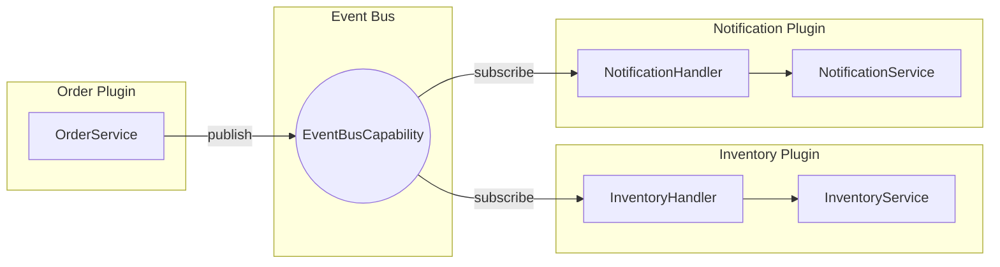

# Event-Driven Plugin Example

A complete example demonstrating cross-plugin communication via events.

## Scenario

An e-commerce system with three plugins:
- **Order Plugin** - Creates orders and publishes events
- **Inventory Plugin** - Reserves stock on order creation
- **Notification Plugin** - Sends notifications on order events

## Architecture



## Event Definitions

Events are shared via a common shared module:

```java
// platform-commons/src/main/java/io/brix/platform/commons/event/IntegrationEvent.java
package io.brix.platform.commons.event;

/**
 * Marker interface for integration events.
 * Integration events cross plugin boundaries.
 */
public interface IntegrationEvent {
    String eventId();
    String timestamp();
}
```

```java
// order-plugin-shared/src/main/java/com/example/order/event/OrderCreatedEvent.java
package com.example.order.event;

import io.brix.platform.commons.event.IntegrationEvent;

/**
 * Published when a new order is created.
 * Contains only primitive types for serialization safety.
 */
public record OrderCreatedEvent(
    String eventId,
    String timestamp,
    String orderId,
    String customerId,
    String customerEmail,
    String totalAmount,
    String itemsJson  // JSON array of items
) implements IntegrationEvent {}
```

```java
// order-plugin-shared/src/main/java/com/example/order/event/OrderCompletedEvent.java
package com.example.order.event;

import io.brix.platform.commons.event.IntegrationEvent;

public record OrderCompletedEvent(
    String eventId,
    String timestamp,
    String orderId,
    String customerId
) implements IntegrationEvent {}
```

```java
// order-plugin-shared/src/main/java/com/example/order/event/OrderCancelledEvent.java
package com.example.order.event;

import io.brix.platform.commons.event.IntegrationEvent;

public record OrderCancelledEvent(
    String eventId,
    String timestamp,
    String orderId,
    String reason
) implements IntegrationEvent {}
```

## Order Plugin (Publisher)

### Order Service

```java
// order-plugin-core/src/main/java/com/example/order/service/OrderService.java
package com.example.order.service;

import com.example.order.event.*;
import com.example.order.shared.*;
import io.brix.runtime.sdk.api.DataAccessCapability;
import io.brix.runtime.sdk.api.EventBusCapability;
import com.fasterxml.jackson.databind.ObjectMapper;
import org.springframework.stereotype.Service;
import org.springframework.transaction.annotation.Transactional;

import java.time.Instant;
import java.util.UUID;

@Service
public class OrderService {
    
    private final DataAccessCapability dataAccess;
    private final EventBusCapability eventBus;
    private final ObjectMapper objectMapper;
    
    public OrderService(
            DataAccessCapability dataAccess,
            EventBusCapability eventBus,
            ObjectMapper objectMapper) {
        this.dataAccess = dataAccess;
        this.eventBus = eventBus;
        this.objectMapper = objectMapper;
    }
    
    /**
     * Creates a new order and publishes OrderCreatedEvent.
     */
    @Transactional
    public Order createOrder(CreateOrderCommand command) {
        // Create order
        Order order = Order.builder()
            .id(UUID.randomUUID().toString())
            .customerId(command.customerId())
            .customerEmail(command.customerEmail())
            .items(command.items())
            .status(OrderStatus.PENDING)
            .total(calculateTotal(command.items()))
            .createdAt(Instant.now())
            .build();
        
        // Save to database
        Order saved = dataAccess.save(order);
        
        // Publish integration event
        String itemsJson = serializeItems(saved.getItems());
        
        OrderCreatedEvent event = new OrderCreatedEvent(
            UUID.randomUUID().toString(),      // eventId
            Instant.now().toString(),           // timestamp
            saved.getId(),                      // orderId
            saved.getCustomerId(),              // customerId
            saved.getCustomerEmail(),           // customerEmail
            saved.getTotal().toString(),        // totalAmount
            itemsJson                           // itemsJson
        );
        
        eventBus.publish(event);
        
        return saved;
    }
    
    /**
     * Completes an order and publishes OrderCompletedEvent.
     */
    @Transactional
    public Order completeOrder(String orderId) {
        Order order = dataAccess.findById(Order.class, orderId);
        if (order == null) {
            throw new OrderNotFoundException(orderId);
        }
        
        order.setStatus(OrderStatus.COMPLETED);
        order.setCompletedAt(Instant.now());
        
        Order saved = dataAccess.save(order);
        
        eventBus.publish(new OrderCompletedEvent(
            UUID.randomUUID().toString(),
            Instant.now().toString(),
            saved.getId(),
            saved.getCustomerId()
        ));
        
        return saved;
    }
    
    /**
     * Cancels an order and publishes OrderCancelledEvent.
     */
    @Transactional
    public void cancelOrder(String orderId, String reason) {
        Order order = dataAccess.findById(Order.class, orderId);
        if (order == null) {
            throw new OrderNotFoundException(orderId);
        }
        
        order.setStatus(OrderStatus.CANCELLED);
        order.setCancellationReason(reason);
        order.setCancelledAt(Instant.now());
        
        dataAccess.save(order);
        
        eventBus.publish(new OrderCancelledEvent(
            UUID.randomUUID().toString(),
            Instant.now().toString(),
            orderId,
            reason
        ));
    }
    
    private String serializeItems(List<OrderItem> items) {
        try {
            return objectMapper.writeValueAsString(items);
        } catch (Exception e) {
            throw new RuntimeException("Failed to serialize items", e);
        }
    }
    
    private BigDecimal calculateTotal(List<OrderItem> items) {
        return items.stream()
            .map(item -> item.price().multiply(BigDecimal.valueOf(item.quantity())))
            .reduce(BigDecimal.ZERO, BigDecimal::add);
    }
}
```

## Inventory Plugin (Subscriber)

### Inventory Event Handler

```java
// inventory-plugin-core/src/main/java/com/example/inventory/handler/OrderEventHandler.java
package com.example.inventory.handler;

import com.example.inventory.service.InventoryService;
import com.example.order.event.OrderCreatedEvent;
import com.example.order.event.OrderCancelledEvent;
import io.brix.runtime.sdk.api.EventHandler;
import io.brix.runtime.sdk.api.CacheCapability;
import com.fasterxml.jackson.core.type.TypeReference;
import com.fasterxml.jackson.databind.ObjectMapper;
import org.springframework.stereotype.Component;

import java.time.Duration;
import java.util.List;

/**
 * Handles order events to manage inventory.
 */
@Component
public class OrderEventHandler {
    
    private static final String PROCESSED_KEY_PREFIX = "inventory:processed:";
    
    private final InventoryService inventoryService;
    private final CacheCapability cache;
    private final ObjectMapper objectMapper;
    
    public OrderEventHandler(
            InventoryService inventoryService,
            CacheCapability cache,
            ObjectMapper objectMapper) {
        this.inventoryService = inventoryService;
        this.cache = cache;
        this.objectMapper = objectMapper;
    }
    
    /**
     * Reserves inventory when an order is created.
     */
    @EventHandler(topic = "order.created")
    public void onOrderCreated(OrderCreatedEvent event) {
        // Idempotency check
        String processedKey = PROCESSED_KEY_PREFIX + event.eventId();
        if (cache.exists(processedKey)) {
            return; // Already processed
        }
        
        try {
            // Parse items from JSON
            List<OrderItemDto> items = parseItems(event.itemsJson());
            
            // Reserve inventory for each item
            for (OrderItemDto item : items) {
                inventoryService.reserveStock(
                    event.orderId(),
                    item.productId(),
                    item.quantity()
                );
            }
            
            // Mark as processed (keep for 7 days for debugging)
            cache.set(processedKey, "1", Duration.ofDays(7));
            
        } catch (Exception e) {
            // Don't mark as processed - allow retry
            throw new EventProcessingException(
                "Failed to reserve inventory for order: " + event.orderId(), e
            );
        }
    }
    
    /**
     * Releases reserved inventory when an order is cancelled.
     */
    @EventHandler(topic = "order.cancelled")
    public void onOrderCancelled(OrderCancelledEvent event) {
        String processedKey = PROCESSED_KEY_PREFIX + event.eventId();
        if (cache.exists(processedKey)) {
            return;
        }
        
        try {
            // Release all reservations for this order
            inventoryService.releaseReservations(event.orderId());
            
            cache.set(processedKey, "1", Duration.ofDays(7));
            
        } catch (Exception e) {
            throw new EventProcessingException(
                "Failed to release inventory for order: " + event.orderId(), e
            );
        }
    }
    
    private List<OrderItemDto> parseItems(String itemsJson) {
        try {
            return objectMapper.readValue(
                itemsJson, 
                new TypeReference<List<OrderItemDto>>() {}
            );
        } catch (Exception e) {
            throw new RuntimeException("Failed to parse items JSON", e);
        }
    }
    
    private record OrderItemDto(
        String productId,
        int quantity, 
        String price
    ) {}
}
```

### Inventory Service

```java
// inventory-plugin-core/src/main/java/com/example/inventory/service/InventoryService.java
package com.example.inventory.service;

import com.example.inventory.shared.*;
import io.brix.runtime.sdk.api.DataAccessCapability;
import io.brix.runtime.sdk.api.LockCapability;
import org.springframework.stereotype.Service;
import org.springframework.transaction.annotation.Transactional;

import java.time.Duration;
import java.time.Instant;
import java.util.List;
import java.util.Map;
import java.util.UUID;

@Service
public class InventoryService {
    
    private final DataAccessCapability dataAccess;
    private final LockCapability lock;
    
    public InventoryService(DataAccessCapability dataAccess, LockCapability lock) {
        this.dataAccess = dataAccess;
        this.lock = lock;
    }
    
    /**
     * Reserves stock for an order.
     * Uses distributed locking to prevent overselling.
     */
    @Transactional
    public void reserveStock(String orderId, String productId, int quantity) {
        // Acquire lock on product
        var productLock = lock.acquire(
            "inventory:" + productId, 
            Duration.ofSeconds(10)
        );
        
        try {
            // Get current inventory
            Inventory inventory = dataAccess.findById(Inventory.class, productId);
            if (inventory == null) {
                throw new ProductNotFoundException(productId);
            }
            
            // Check available stock
            int available = inventory.getQuantity() - inventory.getReserved();
            if (available < quantity) {
                throw new InsufficientStockException(productId, quantity, available);
            }
            
            // Reserve stock
            inventory.setReserved(inventory.getReserved() + quantity);
            dataAccess.save(inventory);
            
            // Create reservation record
            StockReservation reservation = new StockReservation(
                UUID.randomUUID().toString(),
                orderId,
                productId,
                quantity,
                Instant.now()
            );
            dataAccess.save(reservation);
            
        } finally {
            lock.release(productLock);
        }
    }
    
    /**
     * Releases all reservations for an order.
     */
    @Transactional
    public void releaseReservations(String orderId) {
        // Find all reservations for this order
        List<StockReservation> reservations = dataAccess.findBy(
            StockReservation.class,
            Map.of("orderId", orderId)
        );
        
        for (StockReservation reservation : reservations) {
            var productLock = lock.acquire(
                "inventory:" + reservation.productId(),
                Duration.ofSeconds(10)
            );
            
            try {
                // Get inventory
                Inventory inventory = dataAccess.findById(
                    Inventory.class, 
                    reservation.productId()
                );
                
                if (inventory != null) {
                    // Release reserved quantity
                    inventory.setReserved(
                        Math.max(0, inventory.getReserved() - reservation.quantity())
                    );
                    dataAccess.save(inventory);
                }
                
                // Delete reservation
                dataAccess.delete(reservation);
                
            } finally {
                lock.release(productLock);
            }
        }
    }
}
```

## Notification Plugin (Subscriber)

### Notification Event Handler

```java
// notification-plugin-core/src/main/java/com/example/notification/handler/OrderNotificationHandler.java
package com.example.notification.handler;

import com.example.notification.service.NotificationService;
import com.example.order.event.OrderCreatedEvent;
import com.example.order.event.OrderCompletedEvent;
import com.example.order.event.OrderCancelledEvent;
import io.brix.runtime.sdk.api.EventHandler;
import io.brix.runtime.sdk.api.CacheCapability;
import org.springframework.stereotype.Component;

import java.time.Duration;

/**
 * Sends notifications for order events.
 */
@Component
public class OrderNotificationHandler {
    
    private static final String PROCESSED_KEY_PREFIX = "notification:processed:";
    
    private final NotificationService notificationService;
    private final CacheCapability cache;
    
    public OrderNotificationHandler(
            NotificationService notificationService,
            CacheCapability cache) {
        this.notificationService = notificationService;
        this.cache = cache;
    }
    
    @EventHandler(topic = "order.created")
    public void onOrderCreated(OrderCreatedEvent event) {
        if (alreadyProcessed(event.eventId())) return;
        
        notificationService.sendEmail(
            event.customerEmail(),
            "Order Confirmation",
            String.format(
                "Your order %s has been received. Total: $%s",
                event.orderId(),
                event.totalAmount()
            )
        );
        
        markProcessed(event.eventId());
    }
    
    @EventHandler(topic = "order.completed")
    public void onOrderCompleted(OrderCompletedEvent event) {
        if (alreadyProcessed(event.eventId())) return;
        
        // Look up customer email
        String email = notificationService.getCustomerEmail(event.customerId());
        
        notificationService.sendEmail(
            email,
            "Order Shipped",
            String.format(
                "Your order %s has been shipped!",
                event.orderId()
            )
        );
        
        markProcessed(event.eventId());
    }
    
    @EventHandler(topic = "order.cancelled")
    public void onOrderCancelled(OrderCancelledEvent event) {
        if (alreadyProcessed(event.eventId())) return;
        
        // This could send cancellation confirmation
        // Omitted for brevity
        
        markProcessed(event.eventId());
    }
    
    private boolean alreadyProcessed(String eventId) {
        return cache.exists(PROCESSED_KEY_PREFIX + eventId);
    }
    
    private void markProcessed(String eventId) {
        cache.set(PROCESSED_KEY_PREFIX + eventId, "1", Duration.ofDays(7));
    }
}
```

## Testing Event Handlers

```java
// inventory-plugin-core/src/test/java/com/example/inventory/handler/OrderEventHandlerTest.java
package com.example.inventory.handler;

import com.example.inventory.service.InventoryService;
import com.example.order.event.OrderCreatedEvent;
import io.brix.runtime.sdk.api.CacheCapability;
import io.brix.testing.BrixTest;
import io.brix.testing.MockCapability;
import com.fasterxml.jackson.databind.ObjectMapper;
import org.junit.jupiter.api.BeforeEach;
import org.junit.jupiter.api.Test;
import org.mockito.Mock;

import java.util.Optional;

import static org.mockito.Mockito.*;

@BrixTest
class OrderEventHandlerTest {
    
    @MockCapability
    private CacheCapability cache;
    
    @Mock
    private InventoryService inventoryService;
    
    private OrderEventHandler handler;
    
    @BeforeEach
    void setUp() {
        handler = new OrderEventHandler(
            inventoryService,
            cache,
            new ObjectMapper()
        );
    }
    
    @Test
    void shouldReserveInventoryOnOrderCreated() {
        // Arrange
        when(cache.exists(anyString())).thenReturn(false);
        
        String itemsJson = """
            [{"productId":"prod-1","quantity":2,"price":"9.99"}]
            """;
        
        OrderCreatedEvent event = new OrderCreatedEvent(
            "event-1",
            "2024-01-01T00:00:00Z",
            "order-123",
            "customer-1",
            "test@example.com",
            "19.98",
            itemsJson
        );
        
        // Act
        handler.onOrderCreated(event);
        
        // Assert
        verify(inventoryService).reserveStock("order-123", "prod-1", 2);
        verify(cache).set(eq("inventory:processed:event-1"), any(), any());
    }
    
    @Test
    void shouldBeIdempotent() {
        // Arrange - event already processed
        when(cache.exists("inventory:processed:event-1")).thenReturn(true);
        
        OrderCreatedEvent event = new OrderCreatedEvent(
            "event-1", "2024-01-01T00:00:00Z",
            "order-123", "customer-1", "test@example.com",
            "19.98", "[]"
        );
        
        // Act
        handler.onOrderCreated(event);
        
        // Assert - shouldn't process
        verify(inventoryService, never()).reserveStock(any(), any(), anyInt());
    }
}
```

## Frontend Event Subscription

```typescript
// order-plugin-web/src/viewmodels/useOrderEvents.ts
import { useEffect, useCallback } from '@brix/shared-runtime-web';
import { useCapability, EventBusCapability } from '@brix/runtime-sdk-api-web';

interface OrderCreatedEvent {
  orderId: string;
  customerId: string;
  totalAmount: string;
}

interface UseOrderEventsProps {
  onOrderCreated?: (event: OrderCreatedEvent) => void;
}

export function useOrderEvents({ onOrderCreated }: UseOrderEventsProps) {
  const eventBus = useCapability(EventBusCapability);
  
  useEffect(() => {
    if (!onOrderCreated) return;
    
    const subscription = eventBus.subscribe<OrderCreatedEvent>(
      'order.created',
      onOrderCreated
    );
    
    return () => {
      eventBus.unsubscribe(subscription);
    };
  }, [eventBus, onOrderCreated]);
}

// Usage
function OrderDashboard() {
  const addOrder = useCallback((event: OrderCreatedEvent) => {
    // Update real-time dashboard
    console.log('New order:', event.orderId);
  }, []);
  
  useOrderEvents({ onOrderCreated: addOrder });
  
  return <div>...</div>;
}
```

## Key Patterns

1. **Event naming** - `{entity}.{action}` format (e.g., `order.created`)
2. **Idempotency** - Track processed event IDs in cache
3. **Error handling** - Don't mark as processed on failure
4. **Primitive payloads** - Only strings and numbers in events
5. **Distributed locks** - Prevent race conditions
6. **Loose coupling** - Plugins don't import each other

## Next Steps

- [Hello Plugin](./hello-plugin) - Start simple
- [CRUD Plugin](./crud-plugin) - Data operations
- [Event Model](../concepts/event-model) - Event concepts
