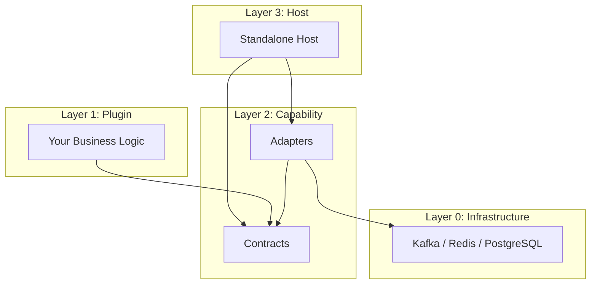

# Introduction to Brix Framework

Brix is a **Runtime Shell framework** that enables you to build modular, pluggable enterprise applications where business logic is completely decoupled from infrastructure.

## The Problem

Traditional enterprise applications face several challenges:

1. **Infrastructure Lock-in**: Business code is tightly coupled to Kafka, Redis, PostgreSQL
2. **Difficult Testing**: Need actual infrastructure to run tests
3. **Version Fragmentation**: Different teams use different library versions
4. **Deployment Inflexibility**: Hard to run the same code in different environments

## The Solution: Runtime Shell

Brix introduces the **Runtime Shell Architecture**, where:

- **Plugins** contain your business logic and depend only on **Capability Contracts**
- **Adapters** implement those contracts using actual infrastructure
- **Hosts** assemble plugins + adapters without any business logic

## Core Design Constraints

Brix enforces 8 core design constraints:

| # | Constraint | Description |
|---|------------|-------------|
| 1 | **Runtime Shell = Capability Model** | It's interfaces, not a framework or middleware |
| 2 | **Plugins → Contracts Only** | No Kafka/Redis/HTTP client imports in plugins |
| 3 | **Host Capability Equivalence** | Standalone and Embedded provide same interfaces |
| 4 | **Event-Based Plugin Communication** | Plugins communicate via events, never directly |
| 5 | **Invisible Complexity** | Plugin devs only see Capability Contracts |
| 6 | **Ultra-Thin Host** | Host = pom.xml + YAML + Boot class (<30 lines) |
| 7 | **Full-Stack Separation** | Frontend View → ViewModel → Repository layers |
| 8 | **Shared Runtime Single Source** | All React/Router from @brix/shared-runtime-web |

## Architecture Layers

### Layer 0: Infrastructure
- Kafka, Redis, PostgreSQL, MinIO
- Completely hidden from plugins
- Managed by Layer 2C adapters

### Layer 1: Plugins
- Your business logic
- Depends ONLY on Layer 2A contracts
- Smallest deployable/sellable unit

### Layer 2: Capability Layer
- **2A**: Contracts - Pure interfaces (EventBusCapability, StateStoreCapability)
- **2B**: Shared Runtime - React, Router, State for frontend
- **2C**: Implementations - Kafka adapter, Redis adapter

### Layer 3: Host
- Ultra-thin assembly shell
- Zero implementation code
- Configuration-driven capability selection

## Deployment Modes

| Mode | Description | Use Case |
|------|-------------|----------|
| **Standalone** | Full platform deployment | Customer buys complete product |
| **Embedded** | Plugin as independent service | Plugin embedded in customer's system |

Both modes provide **identical Capability Contracts** - your plugin code doesn't change.

## Next Steps

1. [Installation](./installation) - Set up your development environment
2. [Quick Start](./quick-start) - Create your first plugin in 5 minutes
3. [Core Concepts](../concepts/runtime-shell) - Deep dive into the architecture
