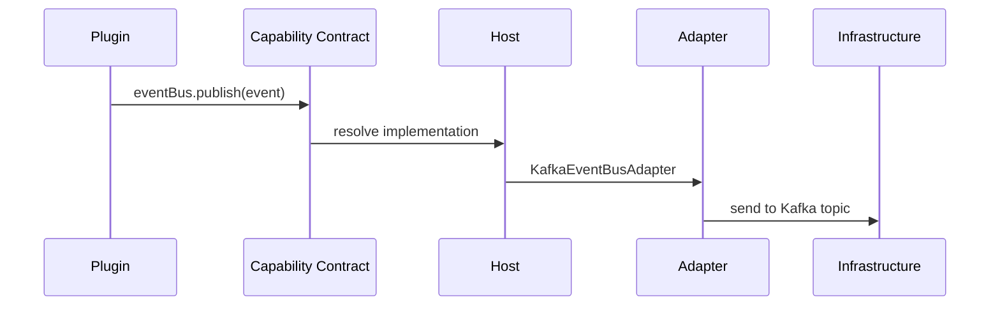

# Quick Start

Create your first Brix plugin in under 5 minutes.

## Prerequisites

Make sure you have completed the [Installation](./installation) guide.

## Step 1: Create a New Plugin

```bash
# Create a new plugin called "todo-plugin"
pnpm create @brix/brix plugin todo-plugin

# Follow the prompts:
# ? Plugin name: todo-plugin
# ? Description: A simple TODO management plugin
# ? Include frontend? Yes
# ? Frontend type: Web
# ? Include backend? Yes
```

This generates:

```
todo-plugin/
├── frontend/
│   ├── web/
│   │   ├── pages/
│   │   ├── components/
│   │   ├── hooks/
│   │   └── repositories/
│   └── shared/           # Shared types between frontend/backend
├── backend/
│   ├── core/             # Domain logic
│   ├── server/           # REST controllers
│   └── test/             # Architecture tests
├── package.json
└── pom.xml
```

## Step 2: Understand the Structure

### Frontend (Layer 1 - Plugin)

```typescript title="frontend/web/hooks/useTodoList.ts"
import { useCapability } from '@brix/runtime-sdk-api-web';
import { HttpCapability } from '@brix/runtime-sdk-api-web';

/**
 * ViewModel hook for TODO list management.
 * 
 * Note: No direct HTTP calls! Uses HttpCapability from runtime.
 */
export function useTodoList() {
  // Get HTTP capability from runtime - NOT axios/fetch
  const http = useCapability(HttpCapability);
  
  const fetchTodos = async () => {
    return http.get('/api/todos');
  };
  
  return { fetchTodos };
}
```

### Backend (Layer 1 - Plugin)

```java title="backend/core/TodoService.java"
import io.brix.runtime.sdk.api.EventBusCapability;
import io.brix.runtime.sdk.api.RuntimeContext;

/**
 * TODO domain service.
 * 
 * Note: No Kafka imports! Uses EventBusCapability from runtime.
 */
@Service
public class TodoService {
    
    private final EventBusCapability eventBus;
    
    public TodoService(RuntimeContext context) {
        // Get capability from runtime - NOT Kafka client
        this.eventBus = context.getCapability(EventBusCapability.class);
    }
    
    public void completeTodo(String todoId) {
        // Business logic here
        
        // Publish domain event - infrastructure agnostic
        eventBus.publish("todo.completed", new TodoCompletedEvent(todoId));
    }
}
```

## Step 3: Run the Plugin

```bash
cd todo-plugin

# Install dependencies
pnpm install

# Start frontend development server
pnpm dev:frontend

# In another terminal, start backend
pnpm dev:backend
```

Access your plugin:
- Frontend: http://localhost:3000
- Backend API: http://localhost:8080

## Step 4: Run Architecture Tests

Every plugin includes Architecture Guard tests:

```bash
# Run architecture tests
mvn test -pl backend

# Expected output:
# ✓ noInfrastructureImportsInDomain
# ✓ controllersDependOnlyOnContracts
# ✓ noDirectDatabaseAccess
# ... (13 red-line rules)
```

These tests enforce the Brix design constraints automatically.

## What's Happening Under the Hood?

1. **Your plugin code** uses only Capability Contracts (interfaces)
2. **At runtime**, the Host injects actual implementations (Kafka, Redis, etc.)
3. **During testing**, you can inject mocks without any infrastructure



## Next Steps

- [Create First Plugin](./create-first-plugin) - Detailed step-by-step tutorial
- [Plugin Model](../concepts/plugin-model) - Understand plugin structure
- [Capability Contract](../concepts/capability-contract) - Available capabilities
- [Architecture Guard](../guides/architecture-guard) - Red-line rules explained
